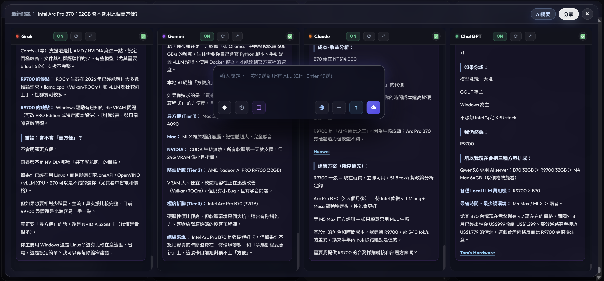
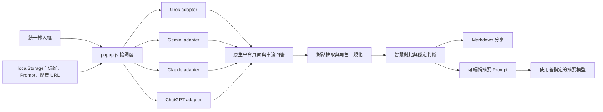

# AI Zoo - Multi-AI Comparison Workspace

> **求職作品｜Chrome Manifest V3 × 多平台 SPA 整合 × 非同步狀態協調 × 跨模型 AI 摘要**

> [!IMPORTANT]
> **作品背景：這是一個已上架 Chrome Web Store、持續維護中的完整產品。** 我想解決的是多 AI 使用者每天都會遇到的真實摩擦：同一個問題要在多個分頁重複貼上、等待、切換，再靠記憶人工比對。AI Zoo 把 Grok、Gemini、Claude 與 ChatGPT 收進同一個工作區，從一次提問、四方回答、智慧對比，到選擇任一 AI 產生綜合摘要與明確結論，形成一條可重複使用的決策工作流。

> [!NOTE]
> **這個作品的重點不只是「把四個網站排在一起」。** 真正的工程挑戰是協調四個持續改版的第三方 SPA、保留各平台原生登入與對話脈絡、判斷串流回答何時真正完成、將異質資料正規化，並在不建立開發者對話後端的前提下完成跨模型摘要。為了嵌入官方頁面，Extension 會透過 `declarativeNetRequest` 調整阻擋 iframe 的安全標頭；權限與風險邊界均公開在程式碼與隱私文件中。

<p align="center">
  
</p>

<p align="center">
  <strong>一次提問，四個觀點，一鍵整理成可行結論。</strong><br>
  Ask once, compare four perspectives, then turn them into one actionable summary.
</p>

## 求職作品重點：我的考量與工程決策

我沒有把這題當成單純的 iframe 排版。核心問題是：**如何把四個彼此獨立、介面隨時會變、回應又是非同步串流的 AI 網站，整合成一個可靠且可維護的產品工作流。**

| 我考量的問題 | 工程決策 | 展示的技術能力 |
| --- | --- | --- |
| 四個平台的 DOM、送出按鈕、Fetch/XHR 與回答格式都不同 | 以共用 `injection-core` 搭配平台設定與專用 content script，將共同行為和供應商差異分離 | Adapter architecture、Chrome MV3、DOM/API reverse engineering |
| iframe 載入完成不等於使用者已登入或輸入框可用 | 分開處理頁面載入、session、OAuth 與 composer readiness，加入重試、逾時與誤判保護 | 非同步狀態機、authentication lifecycle、failure recovery |
| 串流中的回答會持續增長，過早標示完成會截到半篇內容 | 依問題定位回答，結合生成狀態、內容成長與多次穩定輪詢判斷完成 | Streaming coordination、polling strategy、資料一致性 |
| 輪詢常會抓到完全相同的內容，整欄重繪會讓閱讀位置跳到底部 | 先比較下一版 DOM；資料未增加就不更新，確實變更時也依使用者位置決定保留捲動或跟隨底部 | Incremental rendering、scroll preservation、UX state management |
| 各平台回傳結構不同，不能直接拿來比較與分享 | 將 Grok、Gemini、Claude、ChatGPT 的內容整理成一致的 `user/assistant` 訊息模型 | Data normalization、content extraction、defensive parsing |
| 「看完四份答案」仍然需要大量人工整理 | 智慧對比先彙整完整回答與引用，再把 Markdown 內容、可編輯指令送給使用者指定的任一 AI，整理共識、分歧、風險與結論 | Prompt orchestration、cross-model synthesis、human-in-the-loop UX |
| OAuth、舊對話網址與不同帳號可能讓 iframe 看似登出或卡住 | 使用可觀察的 session/composer 訊號確認狀態，並為登入、新對話與失效歷史網址提供恢復路徑 | Session-aware navigation、OAuth integration、resilient UX |
| 對話內容不應再經過不必要的中轉服務 | 問題與回答直接在瀏覽器和各 AI 官方網站之間傳送；摘要指令、介面偏好及歷史網址只保存在目前 Chrome profile | Local-first privacy、permission scoping、security communication |
| 真實產品不只要能跑，也要能發布和持續維護 | 完成 7 種語言、Chrome Web Store 上架、版本打包、商店政策文件與平台改版後的診斷流程 | Product delivery、localization、release and policy thinking |

## 技術專業摘要

- **Chrome Extension / Manifest V3**：service worker、content scripts、MAIN/isolated world、`declarativeNetRequest`、cookies/session 判斷與跨 iframe 訊息傳遞。
- **第三方 SPA 整合**：針對四個獨立網站維護 selectors、原生輸入事件、提交流程、登入狀態與 URL lifecycle。
- **平台 Adapter 架構**：共用注入核心負責重試、監聽與訊息協定；平台層封裝 DOM、Fetch/XHR、解析與抽取差異。
- **非同步資料協調**：處理 iframe 載入競態、串流生成、內容穩定判斷、逾時、重試及只在資料變化時更新畫面。
- **跨模型資料管線**：擷取最新對話、正規化角色與內容、保留引用來源，再重用於歷史、智慧對比、AI 摘要及 Markdown 匯出。
- **AI 摘要工作流**：使用者可編輯摘要 Prompt，並選擇 Grok、Gemini、Claude 或 ChatGPT 作為統整模型，不綁定單一供應商或額外 API key。
- **Local-first 產品設計**：不設開發者對話後端；偏好設定、摘要指令與對話網址保存在瀏覽器本機。
- **產品化與交付**：完成多語系 UI、Chrome Web Store 發布、權限揭露、隱私文件、版本升級與可重複打包流程。

## 專案狀態

| 項目 | 目前狀態 |
| --- | --- |
| 正式產品 | [AI Zoo - Chrome Web Store](https://chromewebstore.google.com/detail/ai-zoo/lfjmcgadcijkapkfhliebaojgmjbnmid?hl=zh-TW) |
| 使用者與評分 | 417 位使用者、5.0 分（1 個評分；2026-08-24 官方商店頁面快照） |
| 目前版本 | `1.2.6` |
| 支援平台 | Grok、Gemini、Claude、ChatGPT |
| 支援語言 | 繁體中文、簡體中文、英文、日文、德文、法文、西班牙文 |
| 核心流程 | 統一提問 → 原生回答 → 智慧對比 → AI 摘要 → Markdown 分享 |

## 產品如何運作

單一模型可能遺漏資訊、產生幻覺，或只反映一種推理路徑。AI Zoo 不假設哪一個模型永遠最好，而是讓使用者以同一題取得四個獨立觀點，再把交叉驗證與整理流程做成產品功能。

1. **一次提問**：從可拖曳的統一輸入框廣播到所有已啟用平台，也可以只送給指定 AI。
2. **保留原生能力**：每個平台仍使用自己的登入 session、模型控制、引用來源與既有對話脈絡。
3. **智慧對比**：自動擷取各平台最新對話，等待串流內容穩定後，在同一個全螢幕面板並排呈現。
4. **AI 摘要**：把四方回答與來源整理成 Markdown，附上使用者可編輯的摘要指令，再交給指定 AI 提煉共識、分歧、風險與最終建議。
5. **分享與留存**：結果可複製、下載為 Markdown 或呼叫系統分享；歷史對話可依群組重新開啟，內容不會自動上傳到開發者伺服器。

## 核心技術流程



## 主要功能

- **四平台並排工作區**：Grok、Gemini、Claude 與 ChatGPT 同時顯示，可個別停用或放大專注。
- **統一輸入與彈性發送**：一次輸入，可廣播到所有 AI 或傳送到單一平台，並支援 `Ctrl+Enter`。
- **智慧對比**：擷取並整理各平台最新回答，集中檢視內容、差異及引用來源。
- **AI 摘要**：任選一個 AI 彙整全部對比內容，摘要 Prompt 可編輯並保存在本機。
- **閱讀位置保護**：輪詢結果相同時不重繪；有新內容時也不強迫已向上閱讀的使用者跳回底部。
- **歷史對話群組**：記錄平台對話網址，可切換、刪除並重新開啟過往多平台討論。
- **Markdown 分享**：一鍵整理、複製、下載或呼叫系統分享，不會自動上傳內容。
- **登入與恢復引導**：辨識 session、composer 與 OAuth 狀態，減少已登入卻誤顯示登入提示的情況。

## 維護與安全邊界

AI Zoo 會與多個第三方 AI 網頁介面互動，因此 selectors、OAuth/login 流程、串流解析與跨 iframe 通訊都可能隨供應商改版而需要維護。Extension 也需要網站存取、cookies 與 `declarativeNetRequest` 權限，並會移除部分阻擋 iframe 的安全標頭；這是核心功能的技術前提，也代表專案必須持續審查 XSS、DOM injection、`postMessage` 來源、content script 權限、token/data leakage 與 CSP/header 規則。

## English Portfolio Summary

AI Zoo is a published Manifest V3 Chrome Extension that turns four independent AI websites into one comparison and synthesis workspace. A user can broadcast one prompt to Grok, Gemini, Claude, and ChatGPT, preserve each provider's native session and citations, normalize the latest streamed conversations, compare them side by side, and route the complete Markdown context plus an editable instruction to any selected AI for a final summary.

The engineering work goes beyond iframe layout: the extension isolates provider-specific DOM and network behavior behind adapters, coordinates authentication and composer readiness, waits for streamed content to stabilize, avoids identical re-renders that reset reading position, restores conversation groups, and keeps preferences and history URLs local. The product is published in seven languages and currently serves 417 Chrome Web Store users (store snapshot: 2026-08-24).

---

## 安裝方式

### 方法 1：從 Chrome Web Store 安裝（推薦）

1. 前往 [AI Zoo Chrome Web Store 頁面](https://chromewebstore.google.com/detail/ai-zoo/lfjmcgadcijkapkfhliebaojgmjbnmid?hl=zh-TW)
2. 點擊「加到 Chrome」
3. 完成！擴充功能已安裝

### 方法 2：開發者模式載入

1. 打開 Chrome 瀏覽器
2. 進入 `chrome://extensions/`
3. 啟用右上角的「開發者模式」
4. 點擊「載入未封裝項目」
5. 選擇此資料夾
6. 完成！擴充功能已安裝

### 方法 3：打包成 .crx 檔案

```bash
# 在 chrome://extensions/ 點擊「封裝擴充功能」
# 選擇 chrome-extension 資料夾
# 生成 .crx 檔案
```

## Installation

### Method 1: Chrome Web Store (Recommended)

1. Visit the [AI Zoo Chrome Web Store page](https://chromewebstore.google.com/detail/ai-zoo/lfjmcgadcijkapkfhliebaojgmjbnmid?hl=zh-TW)
2. Click "Add to Chrome"
3. Done! Extension installed

### Method 2: Developer Mode

1. Open Chrome browser
2. Navigate to `chrome://extensions/`
3. Enable "Developer mode" in the top right corner
4. Click "Load unpacked"
5. Select this folder
6. Done! Extension installed

### Method 3: Pack as .crx File

```bash
# In chrome://extensions/, click "Pack extension"
# Select chrome-extension folder
# Generate .crx file
```

---

## 使用方法

1. 點擊瀏覽器工具列的擴充圖示
2. 在各平台官方頁面完成登入，AI Zoo 會確認 session 與輸入框是否就緒
3. 在統一輸入框輸入問題，選擇「發送到所有 AI」、指定單一平台，或按 `Ctrl+Enter`
4. 觀看 Grok、Gemini、Claude 與 ChatGPT 各自產生完整回答
5. 點擊「智慧對比」，在同一個面板檢視四個平台的最新對話與引用來源
6. 點擊「AI 摘要」，編輯摘要指令並選擇任一平台產生跨模型綜合結論
7. 視需要將對比結果複製、下載成 Markdown，或使用系統分享

## Usage

1. Click the extension icon in the browser toolbar
2. Sign in on each provider's official page; AI Zoo confirms the session and composer readiness
3. Enter a prompt in the unified composer, then broadcast it, choose one platform, or press `Ctrl+Enter`
4. Let Grok, Gemini, Claude, and ChatGPT produce their complete native responses
5. Open **Smart Compare** to inspect the latest conversations and citations in one panel
6. Open **AI Summary**, edit the synthesis instruction, and select any platform to produce a cross-model conclusion
7. Copy, download the comparison as Markdown, or use native system sharing

---

## 狀態指示器

每個 AI 的右上角會顯示狀態：

- ⏳ **載入中**：iframe 正在載入
- ✅ **準備就緒**：AI 已準備好接收問題
- 🔄 **處理中**：正在發送問題或等待回應
- 🔐 **需要登入**：需要完成 OAuth 驗證（見下方說明）
- ❌ **錯誤**：發生錯誤（點擊查看詳情）

## Status Indicators

Each AI displays status in the top right corner:

- ⏳ **Loading**: iframe is loading
- ✅ **Ready**: AI is ready to receive questions
- 🔄 **Processing**: Sending question or waiting for response
- 🔐 **Login Required**: OAuth authentication needed (see below)
- ❌ **Error**: An error occurred (click for details)

---

## AI 平台登入處理

Grok、ChatGPT 與 Claude 會在 iframe 中確認目前瀏覽器 session 是否可用；偵測到需要登入時，會在 iframe 顯示登入引導。基於瀏覽器與供應商的安全限制，實際登入仍在供應商官方來源開啟的新分頁或視窗中完成。Gemini 由使用者登入，擴充功能在可用輸入框出現後才顯示「準備就緒」。

### 支援的平台

- **Grok**：登入狀態確認與新分頁登入引導
- **ChatGPT**：登入狀態確認與彈出視窗登入引導
- **Claude**：登入狀態確認與新視窗登入引導
- **Gemini**：由使用者登入；在偵測到可用輸入框後標示為準備就緒

### Grok 登入引導

1. **檢測登入需求**：當 Grok iframe 需要登入時，會顯示登入提示
2. **點擊登入按鈕**：點擊「在新分頁中登入 Grok」按鈕
3. **新分頁登入**：在新分頁中開啟 `https://accounts.x.ai/sign-in?redirect=grok-com`
4. **完成登入**：在 Grok 的官方登入頁完成登入
5. **回到首頁檢查**：回到 AI Multi-Chat，點擊已登入按鈕後返回 Grok 首頁
6. **開始使用**：Grok 重新確認 session，成功後顯示已登入狀態

### ChatGPT 登入引導

1. **檢測登入需求**：當 ChatGPT iframe 無法確認可用 session 時，顯示登入提示
2. **開啟登入視窗**：點擊提示中的登入按鈕，在小視窗（500x700）開啟 `https://auth.openai.com/log-in`
3. **完成登入**：在彈出視窗中使用 OpenAI 帳號登入
4. **返回聊天頁**：完成後回到 AI Multi-Chat，點擊已登入按鈕返回 ChatGPT 首頁
5. **開始使用**：ChatGPT 重新確認 session，成功後顯示準備就緒

### Claude 登入引導

1. **檢測登入需求**：當 Claude iframe 無法確認可用 session 時，顯示登入提示
2. **開啟登入視窗**：點擊提示中的登入按鈕，開啟 `https://claude.ai/login`
3. **完成登入**：在 Claude 的官方登入頁完成登入
4. **返回聊天頁**：回到 AI Multi-Chat，點擊已登入按鈕返回 Claude 新對話頁
5. **開始使用**：Claude 重新確認 session，成功後顯示準備就緒

### Gemini 登入與就緒狀態

- 由使用者在 Gemini iframe 或 Gemini 官方頁面完成登入。
- 擴充功能會等待可用輸入框出現後再顯示「準備就緒」，最長等待 30 秒。
- 供應商端介面、登入限制或網路狀態變動時，可能仍需要重新整理或重新登入。

### 登入提示界面（Grok、ChatGPT、Claude）

當這些平台需要登入時，iframe 會顯示：
- 🔐 圖示
- **需要登入** 的平台標題
- **在新視窗或分頁中登入** 按鈕（主要操作）
- **我已完成登入** 按鈕（登入完成後返回聊天首頁）
- 💡 操作提示說明

### 狀態提示

**Grok、ChatGPT、Claude**：
- 🔐 **需要登入驗證**：無法確認可用 session 時顯示登入界面
- ✅ **準備就緒**：確認現有瀏覽器 session 可用後即可使用
- 初始載入後會檢查一次，之後每 30 秒重新檢查；網路逾時本身不會直接判定為登出

**Gemini**：
- 由使用者在 iframe 中直接完成登入
- 偵測到可用輸入框後才顯示準備就緒

## AI Platform Login Handling

Grok, ChatGPT, and Claude check whether the current browser session is usable inside the iframe and show guided login when it is not. Due to browser and provider security restrictions, the actual sign-in still happens in a new tab or window at the provider's official origin. Gemini is signed in by the user and is marked ready only after a usable composer appears.

### Supported Platforms

- **Grok**: Login-state confirmation and guided sign-in in a new tab
- **ChatGPT**: Login-state confirmation and guided sign-in in a popup window
- **Claude**: Login-state confirmation and guided sign-in in a new window
- **Gemini**: User signs in; the extension marks it ready after a usable composer is detected

### Grok Guided Login

1. **Detection**: When Grok iframe requires login, a login prompt appears
2. **Click Login**: Click "Login to Grok in New Tab" button
3. **New Tab Login**: Opens `https://accounts.x.ai/sign-in?redirect=grok-com` in new tab
4. **Complete Login**: Sign in at Grok's official login page
5. **Return to Home**: Return to AI Multi-Chat and use the signed-in button to go back to the Grok home page
6. **Start Using**: Grok confirms the session again and shows the signed-in state

### ChatGPT Guided Login

1. **Detect Login Requirement**: When the ChatGPT iframe cannot confirm a usable session, it displays a login prompt
2. **Open Login Window**: Click the prompt's login button to open `https://auth.openai.com/log-in` in a 500x700 popup window
3. **Complete Login**: Sign in with an OpenAI account in the popup window
4. **Return to Chat**: Return to AI Multi-Chat and use the signed-in button to go back to the ChatGPT home page
5. **Start Using**: ChatGPT confirms the session again and then shows Ready

### Claude Guided Login

1. **Detect Login Requirement**: When the Claude iframe cannot confirm a usable session, it displays a login prompt
2. **Open Login Window**: Click the prompt's login button to open `https://claude.ai/login`
3. **Complete Login**: Sign in at Claude's official login page
4. **Return to Chat**: Return to AI Multi-Chat and use the signed-in button to go back to Claude's new-chat page
5. **Start Using**: Claude confirms the session again and then shows Ready

### Gemini Login and Ready State

- Sign in directly in the Gemini iframe or on Gemini's official page.
- The extension waits for a usable composer before showing Ready, for up to 30 seconds.
- Provider UI changes, login restrictions, or network conditions may still require a refresh or a new login.

### Login Prompt Interface (Grok, ChatGPT, and Claude)

When these platforms need login, the iframe displays:
- 🔐 Icon
- A platform-specific **Login Required** title
- A **Sign in in a new tab or window** button (primary action)
- An **I'm signed in** button to return to the chat home page
- 💡 Operation hints

### Status Messages

**Grok, ChatGPT, and Claude**:
- 🔐 **Login Required**: Shown when a usable session cannot be confirmed
- ✅ **Ready**: Shown after the existing browser session is confirmed as usable
- The extension checks once after initial load and then every 30 seconds; a network timeout alone does not mark the user as signed out

**Gemini**:
- The user signs in directly in the iframe
- Ready is shown only after a usable composer is detected

---

## 圖標生成

擴充功能需要 3 個尺寸的圖標：

- `icons/icon16.png` - 16x16 像素
- `icons/icon48.png` - 48x48 像素
- `icons/icon128.png` - 128x128 像素

### 自動生成圖標（推薦）

使用線上工具生成：

1. 前往 https://www.favicon-generator.org/
2. 上傳您的 logo 或圖片
3. 選擇「Chrome Extension」格式
4. 下載並解壓縮到 `icons/` 資料夾

### 手動創建

```bash
# 使用 ImageMagick
convert -size 128x128 xc:#4285f4 -gravity center \
  -pointsize 60 -fill white -annotate +0+0 "AI" \
  icons/icon128.png

convert icons/icon128.png -resize 48x48 icons/icon48.png
convert icons/icon128.png -resize 16x16 icons/icon16.png
```

### 臨時占位符

如果暫時沒有圖標，可以使用任何 PNG 圖片作為占位符：

```bash
# 複製任何圖片作為臨時圖標
cp /path/to/any-image.png icons/icon128.png
cp /path/to/any-image.png icons/icon48.png
cp /path/to/any-image.png icons/icon16.png
```

## Icon Generation

Extension requires 3 icon sizes:

- `icons/icon16.png` - 16x16 pixels
- `icons/icon48.png` - 48x48 pixels
- `icons/icon128.png` - 128x128 pixels

### Auto-Generate Icons (Recommended)

Use online tools:

1. Visit https://www.favicon-generator.org/
2. Upload your logo or image
3. Select "Chrome Extension" format
4. Download and extract to `icons/` folder

### Manual Creation

```bash
# Using ImageMagick
convert -size 128x128 xc:#4285f4 -gravity center \
  -pointsize 60 -fill white -annotate +0+0 "AI" \
  icons/icon128.png

convert icons/icon128.png -resize 48x48 icons/icon48.png
convert icons/icon128.png -resize 16x16 icons/icon16.png
```

### Temporary Placeholder

If icons are temporarily unavailable, use any PNG image:

```bash
# Copy any image as temporary icon
cp /path/to/any-image.png icons/icon128.png
cp /path/to/any-image.png icons/icon48.png
cp /path/to/any-image.png icons/icon16.png
```

---

## 技術架構

### 檔案結構

```
chrome-extension/
├── manifest.json                 # Extension 配置
├── background.js                 # HTTP 標頭攔截
├── popup.html                    # 主頁面
├── popup.css                     # 樣式
├── popup.js                      # 控制邏輯
├── content-scripts/
│   ├── platforms-config.js       # 平台配置
│   ├── injection-core.js         # 核心注入邏輯
│   ├── grok-script.js           # Grok 專用腳本
│   ├── gemini-script.js         # Gemini 專用腳本
│   ├── claude-script.js         # Claude 專用腳本
│   └── chatgpt-script.js        # ChatGPT 專用腳本
├── icons/
│   ├── icon16.png
│   ├── icon48.png
│   └── icon128.png
└── README.md
```

### 核心功能

**1. background.js**
- 攔截 HTTP 響應標頭
- 移除 `X-Frame-Options` 和 `Content-Security-Policy`
- 允許 iframe 載入 AI 網站

**2. content-scripts/**
- 自動注入到每個 AI 平台
- 監聽網路請求（Fetch/XHR）
- 自動填寫問題和點擊發送按鈕
- 擷取 AI 回應並解析

**3. popup.html/css/js**
- 主頁面 UI
- 4 個 iframe 佈局
- 統一輸入控制
- 消息處理和狀態更新
- 對話歷史分組與跨平台回答正規化
- 智慧對比的輪詢、串流穩定判斷與完成狀態管理
- 可編輯 AI 摘要 Prompt、目標模型路由與 Markdown 分享

### 通訊流程

```
popup.js
  ↓ postMessage (AI_SUBMIT_QUESTION)
iframe (grok.com)
  ↓ content-script (grok-script.js)
injection-core.js
  ↓ 填入問題、點擊按鈕
AI 網站
  ↓ 網路請求攔截
injection-core.js
  ↓ postMessage (AI_RESPONSE_RECEIVED)
popup.js
  ↓ 更新狀態
UI 顯示
```

## Technical Architecture

### File Structure

```
chrome-extension/
├── manifest.json                 # Extension configuration
├── background.js                 # HTTP header interception
├── popup.html                    # Main page
├── popup.css                     # Styles
├── popup.js                      # Control logic
├── content-scripts/
│   ├── platforms-config.js       # Platform configuration
│   ├── injection-core.js         # Core injection logic
│   ├── grok-script.js           # Grok-specific script
│   ├── gemini-script.js         # Gemini-specific script
│   ├── claude-script.js         # Claude-specific script
│   └── chatgpt-script.js        # ChatGPT-specific script
├── icons/
│   ├── icon16.png
│   ├── icon48.png
│   └── icon128.png
└── README.md
```

### Core Features

**1. background.js**
- Intercepts HTTP response headers
- Removes `X-Frame-Options` and `Content-Security-Policy`
- Allows AI websites to load in iframes

**2. content-scripts/**
- Auto-injected into each AI platform
- Monitors network requests (Fetch/XHR)
- Auto-fills questions and clicks send buttons
- Captures and parses AI responses

**3. popup.html/css/js**
- Main page UI
- 4 iframe layout
- Unified input control
- Message handling and status updates
- Conversation grouping and normalized cross-platform responses
- Smart Compare polling, stream stabilization, and completion-state management
- Editable AI Summary prompts, target-model routing, and Markdown sharing

### Communication Flow

```
popup.js
  ↓ postMessage (AI_SUBMIT_QUESTION)
iframe (grok.com)
  ↓ content-script (grok-script.js)
injection-core.js
  ↓ Fill question, click button
AI Website
  ↓ Network request interception
injection-core.js
  ↓ postMessage (AI_RESPONSE_RECEIVED)
popup.js
  ↓ Update status
UI Display
```

---

## 常見問題

### Q: iframe 顯示空白？

**A: 請確認**：
1. `background.js` 正常運行（查看 console）
2. 擴充功能有正確的權限
3. 嘗試重新載入擴充功能

### Q: 問題無法發送？

**A: 可能原因**：
1. AI 網站更新了 DOM 結構（需要更新 content-script）
2. Cloudflare 驗證中（等待驗證完成）
3. 查看 iframe 的 console 錯誤訊息

### Q: 回應無法擷取？

**A: 檢查**：
1. 網路監聽是否正常（查看 console）
2. API 端點是否改變
3. 回應格式是否更新

### Q: 如何調試？

**A**：
1. 右鍵點擊擴充圖示 → 「檢查彈出式視窗」
2. 在 popup 頁面中，右鍵點擊 iframe → 「檢查」
3. 查看 Console 的日誌訊息

## FAQ

### Q: iframe shows blank?

**A: Please check**:
1. `background.js` is running (check console)
2. Extension has correct permissions
3. Try reloading the extension

### Q: Question cannot be sent?

**A: Possible reasons**:
1. AI website updated DOM structure (need to update content-script)
2. Cloudflare verification in progress (wait for completion)
3. Check iframe console for error messages

### Q: Response cannot be captured?

**A: Check**:
1. Network monitoring is working (check console)
2. API endpoint has changed
3. Response format has been updated

### Q: How to debug?

**A**:
1. Right-click extension icon → "Inspect popup"
2. In popup page, right-click iframe → "Inspect"
3. Check Console for log messages

---

## 更新日誌

### v1.2.6 (2026-07-24)
- ✅ 改善 Grok 對話還原：若儲存的對話目前無法使用，會清除舊連結並回到 Grok 首頁。
- ✅ 改善 Grok、ChatGPT 與 Claude 的登入狀態判定，減少已登入時誤顯示登入提示的情況。
- ✅ 將上述平台的登入檢查調整為初始檢查後每 30 秒執行，降低不必要的頁面活動。
- ✅ Gemini 只會在可用輸入框出現後顯示「準備就緒」。
- ✅ 未新增擴充功能權限；版本由 1.2.5 升至 1.2.6。

### v1.0.0 (2025-12-19)
- ✅ 初始版本
- ✅ 支援 4 個 AI 平台
- ✅ 統一輸入和發送
- ✅ 即時狀態更新
- ✅ 自動繞過 iframe 限制

## Changelog

### v1.2.6 (2026-07-24)
- ✅ Improved Grok conversation restoration: unavailable saved conversations are cleared and fall back to the Grok home page.
- ✅ Improved login-state handling for Grok, ChatGPT, and Claude to reduce false login-required prompts.
- ✅ Login-state checks now run on initialization and every 30 seconds, reducing unnecessary page activity.
- ✅ Gemini reports Ready only after a usable composer is available.
- ✅ No new extension permissions; version bumped from 1.2.5 to 1.2.6.

### v1.0.0 (2025-12-19)
- ✅ Initial release
- ✅ Support for 4 AI platforms
- ✅ Unified input and sending
- ✅ Real-time status updates
- ✅ Automatic iframe restriction bypass

---

## 授權

MIT License

## License

MIT License

---

## 貢獻

歡迎提交 Issue 和 Pull Request！

## Contributing

Issues and Pull Requests are welcome!

---

## 支援

如有問題，請查看：
1. Console 錯誤訊息
2. 本 README 的常見問題
3. 提交 GitHub Issue

## Support

If you have questions:
1. Check Console error messages
2. Review FAQ in this README
3. Submit a GitHub Issue
